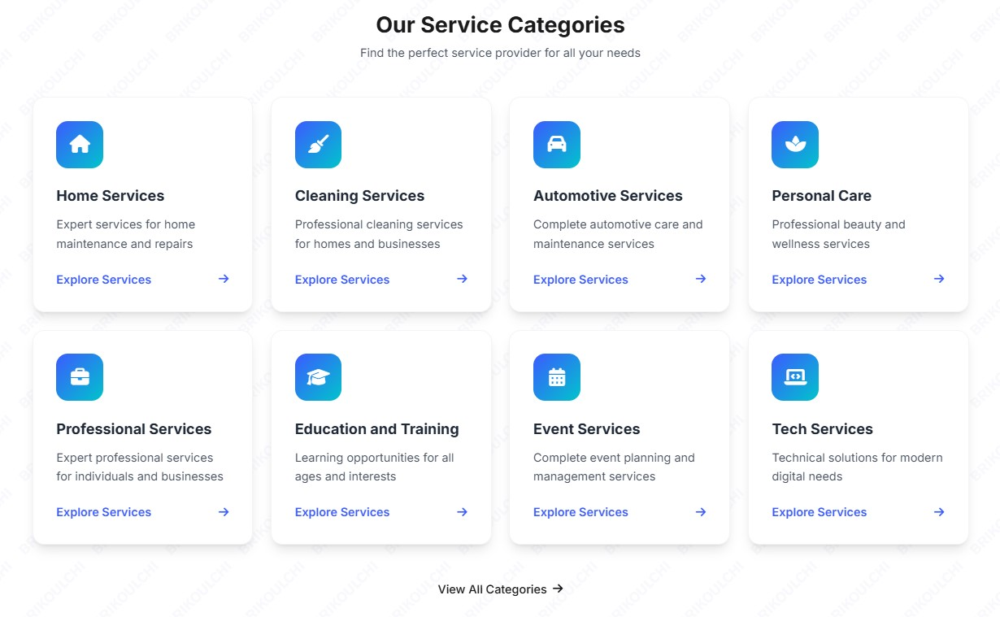
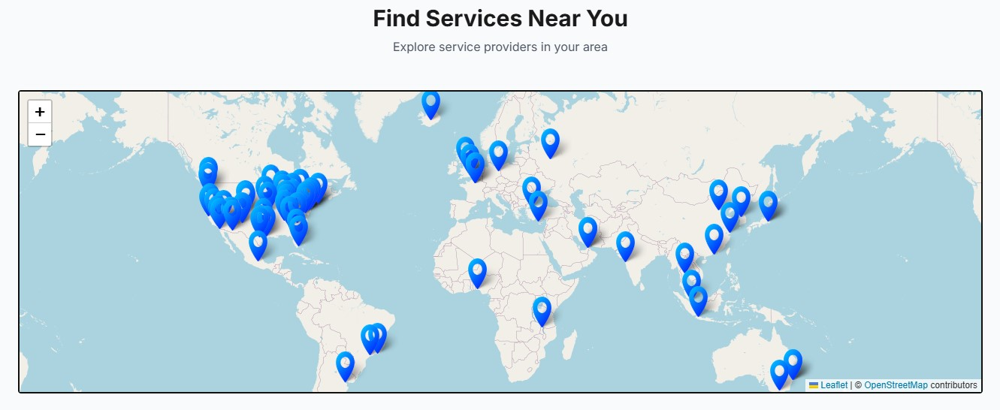
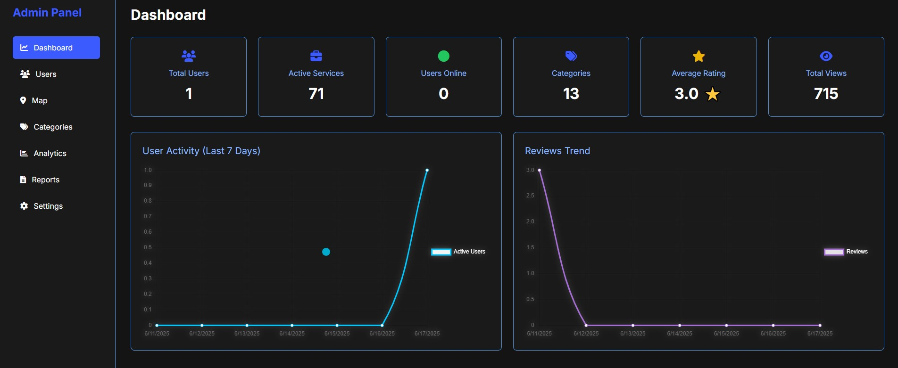
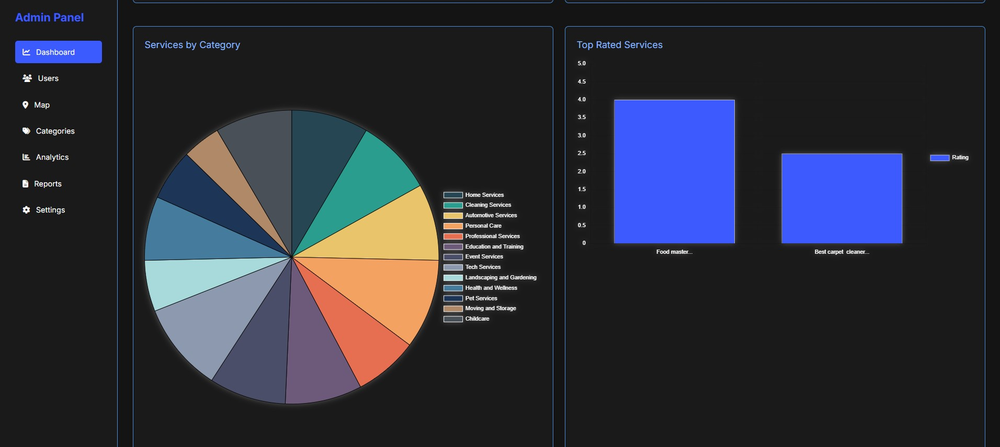
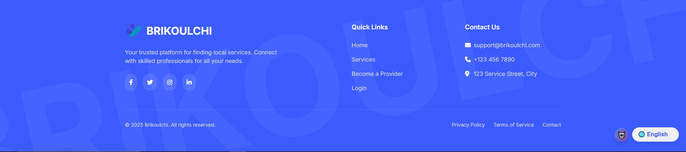

# 🛠️ Brikoulchi - Local Services Platform


## 📋 Overview

Brikoulchi is a comprehensive local services platform that connects service providers with customers in their area. Whether you need a plumber, electrician, or any other service professional, Brikoulchi makes it easy to find and connect with trusted local providers.

### ✨ Key Features

- 🔍 Easy service search and filtering
- 📍 Location-based service discovery
- ⭐ Rating and review system
- 📱 Responsive design for all devices
- 🗺️ Interactive map interface
- 👤 User profiles and service management
- 📊 Admin dashboard with analyticshunterhmaan

## 🚀 Getting Started

### Prerequisites

- Node.js (v14 or higher)
- npm or yarn
- Modern web browser

### Installation

1. Clone the repository:
```bash
git clone https://github.com/yourusername/brikoulchi.git
```

2. Install dependencies:
```bash
cd brikoulchi
npm install
```

3. Start the development server:
```bash
npm run dev
```

## 🎯 Usage

### For Customers

1. Browse available services
2. Filter by category or location
3. View service details and reviews
4. Contact service providers
5. Leave ratings and reviews

### For Service Providers

1. Create a service provider account
2. Add your services
3. Manage your service listings
4. Respond to customer inquiries
5. View your service analytics

## 🎨 UI/UX Features

- Clean and intuitive interface
- Easy navigation
- Mobile-responsive design
- Interactive maps
- Real-time updates
- Accessible design

## 🔧 Technical Stack

- **Frontend**: React.js, Tailwind CSS
- **Routing**: React Router
- **Maps**: Leaflet
- **Charts**: Chart.js
- **Icons**: Font Awesome
- **State Management**: React Context
- **Storage**: Local Storage

## 📱 Screenshots
### Multi Language Support

### Nour AI

### Header

### Home Page

### Categories

### Service Map

### Admin Dashboard
 

### Excel Export Data

### Footer



## 👥 Contributing

We welcome contributions! Please follow these steps:

1. Fork the repository
2. Create your feature branch
3. Commit your changes
4. Push to the branch
5. Create a Pull Request

## 📄 License

This project is licensed under the MIT License - see the [LICENSE](LICENSE) file for details.

## 🙏 Acknowledgments

- Icons by Font Awesome
- Maps by Leaflet
- Images from Pexels

## 🎯 The Brikoulchi Team
- Abahmane Mohamed Amine   - _Front-End Department_
- Akarkoune Abdelali       - _Back-End Department_
- Droussi Mohamed          - _Documentation Department_
- Ayoub Amerzoug           - _Design Department_